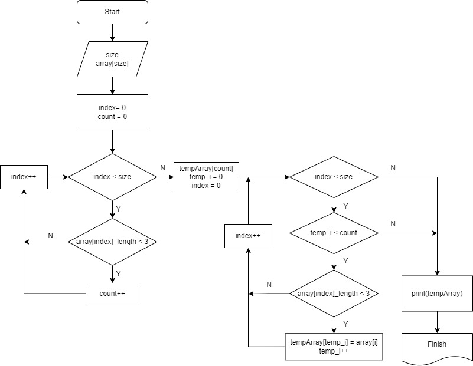

# Итоговая работа первой четверти
## Задание

## Создание алгоритма
На этом этапе создается алгоритм основного метода 

1. Пользователь задает размер массива и вводит каждую строку
2. Добавляем их в заданный массив
3. Циклом проходим по массиву в поисках кол-ва строк с символами меньше или равно 3
4. Создаем новый массив размером в это количество
5. Циклом записываем туда нужные элементы из исходного массива
6. Выводим получившийся массив на экран

## Написание программы
Ориентируюь на блок-схему пишем код. 
Добавляем в основной алгоритм некоторые изменения связанные с выводом данных

* добавить условие на проверку отсутствия символов меньше трёх
* создать дополнительный "пустой" массив для вывода "[]", как прописано в задании